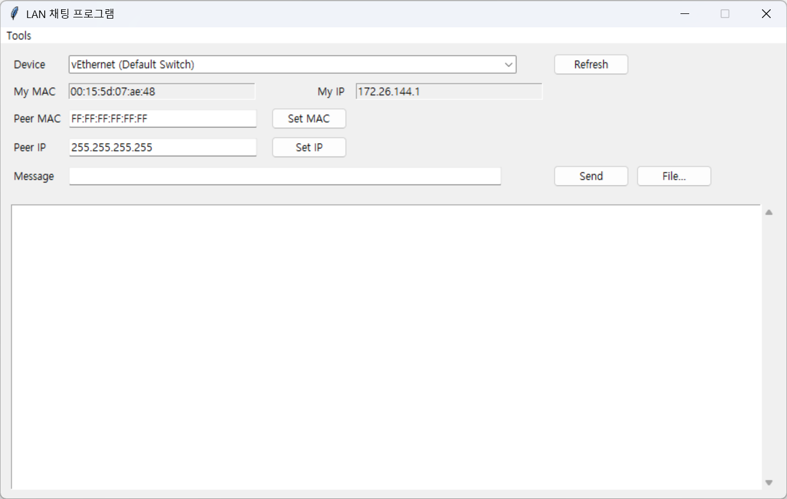

# 구현 예정 사항
메시지 로그:
 * peer끼리 나눈 대화 모두 별도의 폴더에 보관
 * Database 사용은 고려하고 있지 않음 (file-based database)
 * 파일명은 아마 MAC Addr + IP Addr의 조합을 기반으로 할 예정

메시지 삭제:
 * 메시지 로그가 필요함
 * ChatappLayer, FileAppLayer 수정 필요
 * 특정 메시지마다 identifier 부여
 * 삭제 요청 전송 시 로그 및 GUI에서 당 메시지 즉시 찾아 삭제
 * 단, 서로가 클라이언트이자 서버이며, 이를 검증할 방법이 딱히 없어 (PKI 같은 걸 쓰지 않는 한) 단순 편의 목적.

이모지 전송:
 * 파일 전송 기능을 기반으로 구현
 * 정확히는 파일의 mime type이 image인 경우 GUI에 표시하는 것으로
 * 단, 특정 width/height 또는 size 미만의 이미지만 표시하는 것으로 구현 필요성 있음 (네트워크 트래픽 등)

E2EE (미정):
 * TLS를 씌우려면 인증서 발급 등 귀찮은 작업이 필요, 또 이건 서로가 클라이언트이자 서로가 서버인 환경에서는 구현이 곤란함
 * 따라서, src MAC, IP Addr의 조합을 이용하여 키를 생성, 암호화해서, 이를 직접적으로 수신받는 dest peer만이 복호화할 수 있도록 암호화 처리하는 것을 생각 중
 * 그러나 채팅 앱의 암호화 로직을 알고 있으면 그냥 뚫리므로 의미가 있는지는 다소 의문

# 개선 예정 사항
파일 전송:
 * 현재 이미 팀 과제 진행하며 구현된 부분
 * peer에서 파일을 전송하기만 하면 다른 peer의 files 폴더에 자동으로 수신됨
 * 트래픽 문제 및, peer가 악성 파일을 전송하면 어떻게 할 것인지에 대해 대책이 없음
 * 따라서, peer가 파일을 전송하면, 다른 peer에게 mime type이 executable file인 경우 (application/octet-stream 등), 또는 특정 사이즈 이상인 경우, 경고 메시지 표시 및 최종 수락 여부 질의
